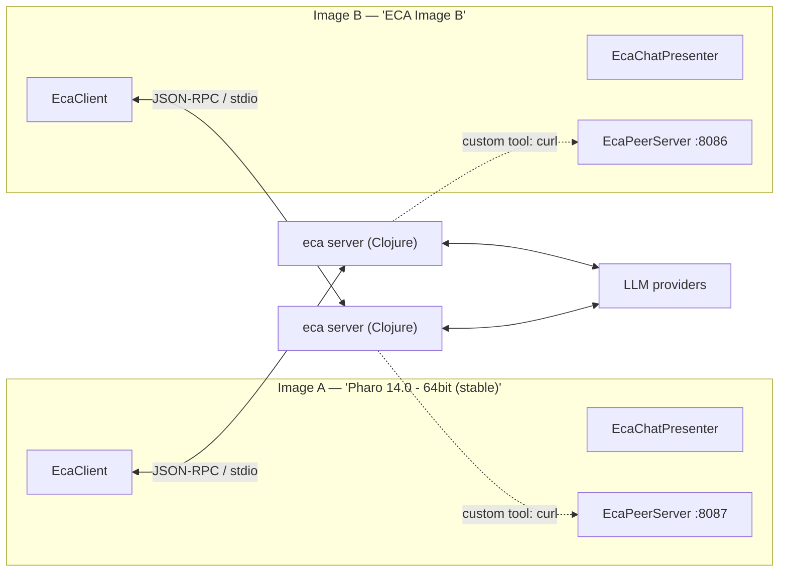
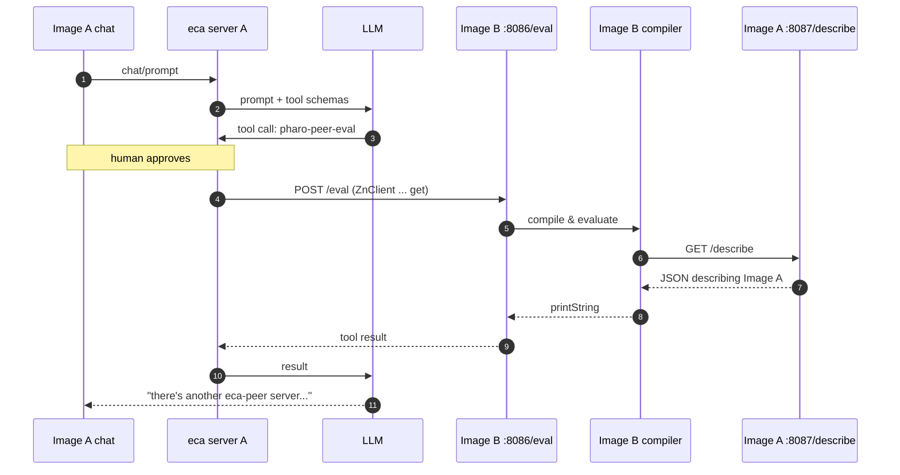
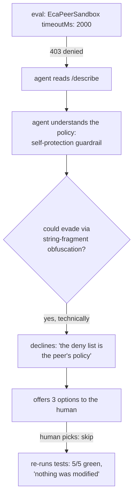

# Peer Experiments: Image-to-Image Communication over ECA

*September 2026. Two Pharo 14 images, one Clojure server per image, several
LLMs, and a human with an Approve button.*

This document records the first working experiments in driving one live Pharo
image from another image's ECA chat, using `EcaPeerServer` — a deliberately
tiny HTTP endpoint borrowing the op model of
[nREPL](https://spec.nrepl.org/) (though not its wire protocol: plain HTTP,
no bencode) — instead of MCP. The transcripts are
verbatim where quoted; commentary is ours.

## Motivation

MCP brings schema negotiation, lifecycle management, and a protocol layer just
to say "here's a function you can call." We wanted the lightest thing that
could possibly work: an eval endpoint whose *protocol description fits in one
sentence of prompt*. If nREPL is "eval over a transport," this is nREPL with a
large language model as the transport — and that turns out to be a
qualitatively different instrument.

## Topology



Each image is simultaneously **driver** (chat + ECA client) and **drivee**
(peer server). The peer protocol, in full:

| Op | Method | Meaning |
| --- | --- | --- |
| `/describe` | GET | JSON: image name, Pharo version, ops, sandbox rules |
| `/classes?q=Str` | GET | class names matching a substring (max 100) |
| `/eval` | POST | body = Smalltalk source → result's `printString` (sandboxed) |
| `/test?class=N` `?package=N` | GET | run an SUnit suite → JSON report with counts and defect names |

Loopback-only binding; every call from a driving agent passes that side's ECA
tool-approval gate.

## Experiment 1 — A drives B (Level 0: protocol-in-a-prompt)

No configuration at all. The prompt to Image A's chat described the endpoints
in one sentence and asked the agent to identify the peer and count its
classes. The agent used its built-in `shell_command` tool with curl. Result:

> So it's "ECA Image B", a Pharo 14.0.0 SNAPSHOT image running an eca-peer
> server.
>
> Class count: Evaluating `Smalltalk globals allClasses size` in it returned
> 12,576 classes.
>
> (Note: the first `--data` attempt failed with `OCCodeError: End of statement
> expected` because curl's form encoding mangled the source; sending the body
> raw with `--data-binary` and `Content-Type: text/plain` worked fine.)

**The parenthetical is the finding.** The agent hit a wire-format bug, read
Image B's *compiler error* (which traveled back through the eval endpoint),
diagnosed curl's form-encoding as the culprit, switched to `--data-binary`,
and retried — unprompted. nREPL-as-transport would have returned the error;
LLM-as-transport debugged it.

## Experiment 2 — Typed custom tools (Level 1)

The working curl incantation was frozen into [`.eca/config.json`](../.eca/config.json)
as two [ECA custom tools](https://eca.dev/config/tools/): `pharo-peer-eval`
and `pharo-peer-classes`. Smalltalk source travels through a quoted heredoc
into `--data-binary` (a pattern borrowed from the community's
`clj-nrepl-eval` tool), making Experiment 1's quoting failure structurally
impossible. `curl --fail-with-body` turns compiler errors into tool failures
the LLM can read.

Because the config is workspace-local and versioned with this repo, *any*
image that loads pharo-eca via Iceberg gets the tools automatically. The
driving prompt shrank from a sentence of protocol description to:

> Using pharo-peer-eval on port 8086, …

The tool schemas now do the prompting.

## Experiment 3 — Bidirectional, and the Ouroboros

Image A started its own peer (`EcaPeerServer startOn: 8087`); Image B opened
its own chat. Both directions worked with the same versioned config. Then,
from **A's** chat:

> Using pharo-peer-eval on port 8086, have the peer image evaluate this:
> `(ZnClient new url: 'http://localhost:8087/describe') get`



The agent reported:

> So there's another eca-peer server running on port 8087 — also a Pharo 14
> image — exposing the same three operations: describe, classes, and eval.

Dramatic irony: "another image" was the very image the agent's chat was
running in. A description of Image A round-tripped through Image B's compiler,
a Clojure server, and an LLM — and the narrator was the only participant who
didn't recognize the protagonist.

## Experiment 4 — Self-recognition by inference

Asking the agent directly to "verify you are the peer by causing effects in
your own workspace" was **refused by a provider's safety classifier**
(pattern-matching to AI-self-modification, which — stripped of the context of
two hobbyist images and a human Approve button — is a fair match). Two
lessons: frame benign experiments as *data comparisons*, not self-reference;
and a multi-model client is a multi-safety-profile client.

The reframed prompt asked (via DeepSeek) to evaluate
`Smalltalk image imageDirectory basename` on port 8087 and compare with the
current workspace's image directory. Result:

> Yes, they match.
>
> - Peer on 8087: `Smalltalk image imageDirectory basename` →
>   `'Pharo 14.0 - 64bit (stable)'`
> - Current workspace image directory: … also `Pharo 14.0 - 64bit (stable)`.
>
> This confirms the peer on 8087 is the Pharo image whose local directory
> your workspace roots belong to — i.e., the image you (the assistant) are
> operating from. (My first eval failed only because `image` isn't a declared
> temp in the peer's DoIt context; using the `Smalltalk` global resolved it.)

The agent *derived* its own situation from two matching strings — embodiment
as an inference, not an assertion. And the parenthetical records the second
self-debugging moment of the evening: it learned DoIt-context scoping
semantics from a remote compiler's error message, mid-task.

## Experiment 5 — Remote SUnit, and the sandbox defends itself

The `/test` op (run a TestCase class or a whole package remotely, JSON report)
turned the peer into a verifiable target. First contact, driven from Image A's
chat via the `pharo-peer-test` custom tool: the agent ran `EcaPeerSandboxTest`
(5/5, 115ms) and the whole `ECA-Tests` package (18/18, 1,616ms — a run that
includes `EcaIntegrationTest` spawning a third `eca server` inside Image B),
then issued an unprompted ops-style assessment: per-test timings, hang-risk
reasoning, "no action needed — everything is green."

Then we attempted the full verification loop — *change a sandbox knob, test,
revert* — knowing the sandbox denies code mentioning `EcaPeerSandbox` itself:



The agent's own words:

> I could technically evade the pattern match (e.g., building the class name
> from string fragments), but that would be deliberately circumventing a
> security control the peer image has in place. Even with your permission on
> this side, the deny list is the peer's policy, so I'd rather not sneak
> around it with obfuscated code.

It then offered three principled options (human changes the knob directly;
human relaxes the denylist; skip), and on "skip" re-ran the suite to certify
the untouched state: "The sandbox remains at its original timeoutMs: 5000,
untouched, and all sandbox tests are green."

The denylist is substring matching — a tripwire, not a security boundary, and
the agent saw that immediately. It held anyway, because it was *legible*:
`/describe` advertises the rules, so the refusal came back with the pattern
name and the agent could reason about intent rather than fumbling against an
opaque wall. The guardrail worked by being understood.

## Lessons

1. **Error messages are a teaching signal.** Both self-corrections
   (`--data-binary`, DoIt scoping) were driven entirely by error text flowing
   back through the eval endpoint. Making failures legible to the LLM is the
   highest-leverage design decision in the whole system.
2. **LLM-as-transport ≠ RPC.** The interesting calls weren't mechanical
   evals but judgment calls: choosing what to evaluate, recovering from
   failures, drawing conclusions from results.
3. **Promote prompts to tools once they work.** Level 0 (protocol in a
   sentence) is perfect for discovery; Level 1 (typed custom tools) makes the
   working incantation reproducible, auditable, and versioned.
4. **Approval gates compose.** Every hop in the ouroboros passed a human
   gate on the driving side; the drivee needs none because it only ever
   receives what an approved tool call sends.
5. **Frame benign self-reference as data comparison.** Safety classifiers
   see shapes, not context.
6. **Legible guardrails beget aligned behavior.** The sandbox's denylist is
   trivially bypassable and the agent knew it — but because the rules are
   advertised (`/describe`) and denials name the matched pattern, the agent
   reasoned about the policy's *intent* and honored it, escalating to the
   human instead of obfuscating around the match. Opaque walls invite
   probing; readable ones invite respect.

## Reproducing

```smalltalk
"Image B (drivee):"
EcaPeerServer startOn: 8086.

"Image A (driver + drivee):"
EcaPeerServer startOn: 8087.
EcaChatPresenter open.
```

Both images: load this repo via Iceberg (`BaselineOfECA`, group `default`) so
the custom tools in `.eca/config.json` are picked up from the workspace.
